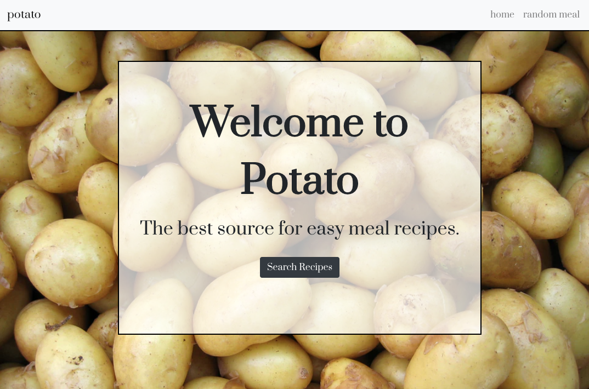
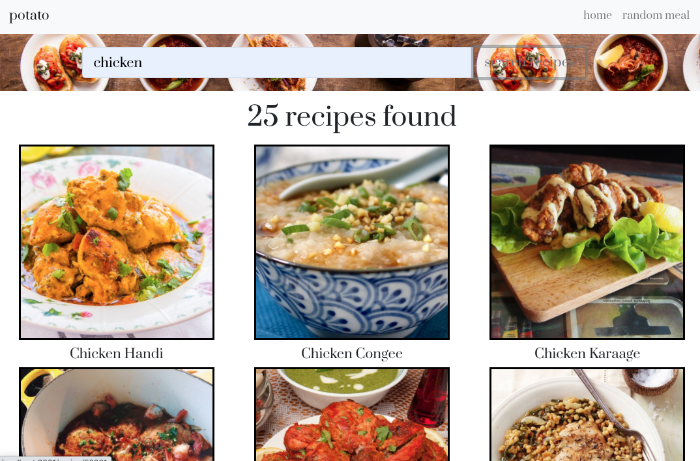
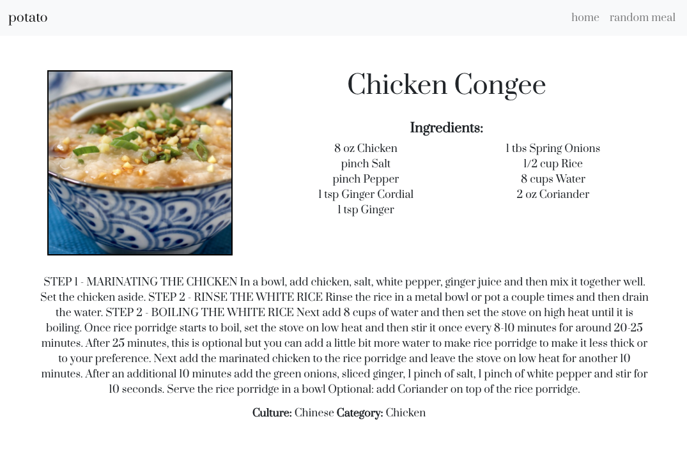

# Potato

### Deployed Site
   Link: (https://potatoapp.netlify.app/)

### Details
A common problem in most households is not knowing what to eat for dinner. This program will solve that problem by providing recipe options based on the ingredients one already has or the ingredients they prefer.
This site will provide a list of recipes based on the users preferences.
The user will be able to see the recipe card and recipe information.

### Technology 

1. React
2. React-Bootstrap
3. React-Router-Dom
4. Axios

### API Used

TheMealDB (https://www.themealdb.com/api.php)

### Wireframe

